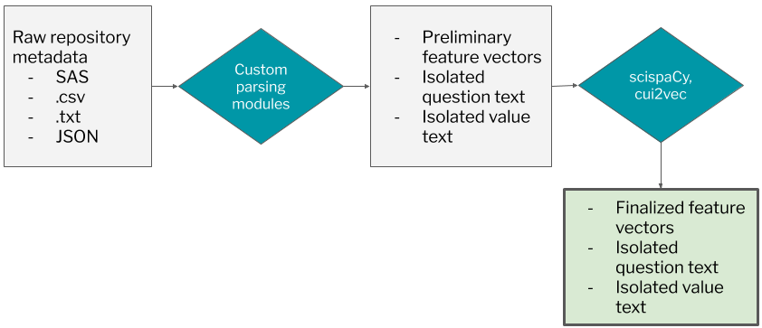
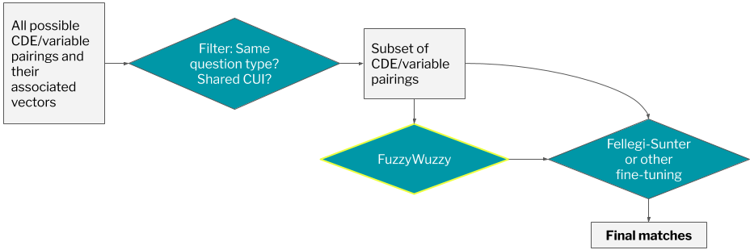

# About #

The [NIDDK Central Repository](https://repository.niddk.nih.gov/home/) (DKCR) is a controlled access data and biospecimen resource available to the broader scientific community, which receives, 
organizes, manages, validates, and distributes study generated resources from ongoing and completed, multi-center and large single-center studies funded
by the NIDDK.

This repository represents first steps in the effort to develop a pipeline that interprets data elements/measurement structures in NIDDK Central Repository studies. 
The pipeline will determine if an element is an already-defined Common Data Element (CDE) from the [NLM CDE repository](https://cde.nlm.nih.gov/). A common data element,
as defined by the NLM, is "a data element that is common to multiple data sets across different studies." Tagging CDEs that exist in DKCR studies will allow NIDDK-funded study 
resources to be more findable, accessible, interoperable and reusable (FAIR), thus facilitating research across all fields. Identifying CDEs is especially important for quickly 
emerging fields of study, such as COVID-19, as it allows researchers to make more effective and efficient use of repository data. DKCR data is especially relevant to COVID 
as it contains data related to social determinants of health, cardiovascular health, obesity, and inflammation, which are all emerging as key COVID risk factors.

The two primary analysis files for this project are `extracting_cdes_from_datasets.ipynb` and `processing_cdes.ipynb`, which are available in the main project folder. 
The bulk of the analysis for this project happens in `extracting_cdes_from_datasets.ipynb`, while `processing_cdes.ipynb` contains some principal analysis that helped
to identify good *starting* `scispaCy` parameters for `extracting_cdes_from_datasets.ipynb` (after observing applied performance, adjustments were made--this process is
explained in the notebook. See explanatory sections for [Processing CDEs](#processing_cdes) and [Extracting CDEs from Datasets](#extracting_cdes_from_datasets) for more 
details on the purpose of each notebook.

# Getting Started #

I created this project in a conda environment, but the use of an environment should not be necessary to run
the program, granted that you install the proper packages on your system environment instead. In fact, that may be preferable. 
All packages were installed using the `pip` installer, and all necessary external packages are listed
in `requirements.txt`. In order to have the best chance at accuracy, this project uses the **large** 
ScispaCy vector set, which is also included in `requirements.txt`.

All analysis was conducted in Jupyter notebooks, so it is necessary to have Jupyter
installed within whatever environment you work in.

Running the following line will download the necessary packages so you can get started:

	$ pip install -r requirements.txt

`extracting_cdes_from_datasets.ipynb` depends on both `bin/parse_cde.py` and `bin/parse_codebook.py`. It is designed to process SAS metadata and Cohort B 
codebook .txt data. In addition to what is included in the repository (see [Data](#data)), the following data is required for the notebook to function: 

* A .csv file containing all of the Harvard `cui2vec` CUI embeddings. This file can be downloaded [here](https://figshare.com/s/00d69861786cd0156d81). This is publicly
available, but could not be included due to size constraints. This file should be stored as `const/cui2vec_pretrained.csv`
* A JSON file containing the JSON strings for all CDEs in the NLM CDE repository. This file can be accessed by opening a blank search in the 
[NLM CDE Repository](https://cde.nlm.nih.gov/cde/search), clicking on "Export Search", and selecting JSON as the format. 
This file should be stored as `data/all_nlm_cdes.json` (because the CDE repository is often changed and updated, we do not consider this a "constant").

# Processing CDEs # 

In order to be able to tag CDEs in repository datasets, we need to be able to parse through and extract the fundamental properties
of CDEs. In the notebook `processing_cdes.ipynb`, we test various methods for extracting fundamentals, comparing CDEs, etc.

The notebook is broken down into multiple sections:

#### Section 1 ####

Analyzes the CDE title and description using the ScispaCy library.

* 1.1 tests the performance of different hyperparameters for ScispaCy's CUI identification pipeline, using precision and recall measurements
* 1.2 plots the performance over different hyperparameters to better visualize results. The apparent best parameter set is chosen, and results
for a discrete and continuous-valued CDE are shown in more detail
* 1.3 tests whether removing a stricter threshold for CUIs with no recorded definition produces better results. TBD: WHICH IS BETTER?

#### Section 2 ####

Analyzes the CDE classification trees. Currently no analysis being done, this is quite complex and may explore later.

#### Section 3 ####

Analyzes CDE value domains. Compares more CDEs than Section 1 as value sets have a lot of variation. Trying to determine different ways to parse through
and compare value sets. Currently checks SpaCy similarity (comparing avg of word vectors) between value descriptions, with poor results.

# Extracting CDEs from Datasets #

`extracting_cdes_from_datasets.ipynb` uses the parameters and methods identified in `processing_cdes.ipnyb` as a jumping-off point. This notebook contains the bulk
of the analysis for this project, with 14 sections that start to explore the project space. For detailed descriptions of each section, see the Jupyter notebook.
The following is a general, high-level overview of the notebook.

Sections 1-4 adjust `scispacy` parameters and experiment with extracting CUI vectors (not just detecting CUIs) from CDEs and codebooks, as well as comparing CDE elements and
codebooks based on CUI vectors. Sections 5 and 6 parse data elements from all Cohort B codebooks and the SAS-to-CSV files for Cohorts A and C. In section 7, we extract their key features 
and descriptive text, generating CUI vector matrices (see notebook for more detailed explanation) and feature vectors for each element. This process can be visualized as the 
pipeline below: 

After pre-processing, we examine comparison methods to determine if a given CDE and data element are a true match. The two key packages implemented are `recordlinkage` and `fuzzywuzzy`. 
`recordlinkage` implements an expectation-maximization algorithm with the Fellegi-Sunter probabilistic record linkage model (unsupervised machine learning) to determine if candidate pairs are true matches.
`fuzzywuzzy` uses fuzzy string matching to compare strings. Both methods are explained in more detail in the notebook. Section 8 defines a function to create comparison vectors given a CDE and data element
feature vector. Section 9 narrows down the field of candidate pairs so that we aren't comparing every possible CDE-data element pair, and section 10 generates the comparison vectors for those pairs. 
Section 11 implements Fellegi-Sunter based on the pair list and comparison vectors from sections 9 and 10. Section 12 tests the efficacy of `fuzzywuzzy` with some pre and post-filtering as a comparison method, 
experimenting with comparing just variable descriptions or both variable descriptions and value descriptions. Finally, Section 13 experiments with implementing `recordlinkage` on the set of candidate pairs
identified by `fuzzywuzzy`, with some additional pre-refinement. Section 14 explains next steps. Below is an approximate summary of the information-processing pipeline:

Moving forward, the final steps of the pipeline need more fine-tuning to rule out more false matches. If using `recordlinkage` after `fuzzywuzzy`, new combinations of features or new parameters need to be
evaluated. Otherwise, it is worth exploring completely new matchmaking methods. Currently, this program excels at producing a few good choices for each data element, one of which is often very close. The
trick is now deciding if we want humans to have to select that best candidate, or if we can automate this process.

Most of the methods here are analyzed qualitatively (taking a look and gauging the overall match quality). It be helpful if we had a labelled set of test data (perhaps a list of variables from one of 
the DKCR studies, each labelled with the CDE they match with if applicable), as this would allow for a more concrete analysis of model performance.

# Bin #

Contains:

* `parse_cde.py`: Contains functions for parsing key information and features from a CDE JSON object. The key function, `parse_cde_obj()`, takes in a CDE JSON object and returns
a dictionary that aggregates key information. `parse_cde_json()` is also used in the Notebooks, which is designed to read in JSON information from a file before calling `parse_cde_obj()` 
* `parse_codebook.py`: Contains functions for parsing .txt "Codebooks", which is the way that NIDDK Central Repository study Cohort B provides variable metadata. These codebooks are stored in
`data/codebooks/*`. While these codebooks are technically readable, they prove very difficult to parse, hence the choice to aggregate these parsing functions in a separate `bin/` file. More 
information and visuals on using `parse_codebook.py` are available in the Jupyter Notebook. Key functions are: `cdb_to_dataframe()`, which reads the table-like .txt file into an actual table
(dataframe), and `parse_codebook_values()`, which parses through the free-text value list/individual value descriptions, attempting to determine features like question type and minimum/maximum value.
* `const/` 
	* `bin/const/custom_stopwords`which contains a .txt file of customized English stopwords (includes single-letter unit abbreviations
that `pint` tends to misidentify as relevant units). 

# Const #

The `const/` folder contains multiple files (formats: .txt and .csv) that hold constant information necessary to run the notebooks.

* `custom_stopwords.txt` - line-separated customized English stopwords (includes single-letter unit abbreviations that `pint` tends to misidentify as relevant units)
* `english_words.txt` - line-separated list of English words
* `sas_date_formats.txt` and `sas_time_formats.txt` - line-separated lists of the prefixes (trailing number removed) of SAS date and time formats
* `cui2vec_pretrained.csv` **is not included in the repository, but should be added to this folder.** You can download it [here](https://figshare.com/s/00d69861786cd0156d81)

# Data #

The `data/` folder has several folders containing key data for this project:

* `data/sample_cdes/` contains a select set of sample CDE JSON files used in initial experimentation. 
* `data/codebooks/` contains .txt codebook files that hold metadata for the Cohort B study. These codebooks pose a special parsing challenge and encode a different set of information features 
than SAS files do for other studies, so it was important to handle these cases and include this data here. 
* `data/cohort_a/` and `data/cohort_c/` contain the format and variable csv files corresponding to Cohorts A and C, respectively. These metadata files do not contain any patient data. 
	* **Note**: These CSVs were created by flattening SAS relational data to extract key metadata. The current project is highly dependent on the metadata structure used in these 
	format and variable .csvs, so they have also been included to illustrate what sort of metadata should be used. Of course, in the future, the project could be updated to process 
	different forms of input data. 

# Misc #

Contains:

* `misc/sample_cde_{continuous/discrete}_pretty.txt`: "Pretty" (indented) versions of sample CDEs to better visualize structure
* `misc/sample_cde_{continuous/discrete}_manual_cui_tags.txt`: Text files showing the CUIs manually identified as potentially present in the two sample CDEs that were prettified. 
In `processing_cdes.ipynb`, these CUI values are used to quantitatively evaluate `scispacy` performance given different parameters
* `misc/demo_day_presentation.pdf` - PDF of NIH Civic Digital Fellows Fall 2020 Demo Day presentation
* `misc/project_one_pager.pdf` - PDF summary of project and results
* `misc/{}.png` - Images used in project notebooks

# Out #

`out/` is a folder to hold output files. Currently, there is only one notebook operation that produces an output file--after generating feature vectors for all CDEs in `extracting_cdes_from_datasets.ipynb`, 
there is a line of code that saves those feature vectors as a .csv to the output folder. This was primarily written out of convenience, as the CDE feature vector-generating step takes an extremely long time 
when being run for all CDEs, so losing that global variable due to a crash or kernel reboot means a lot of lost time. This output file is not included in the repository due to GitHub file size limitations.

# Acknowledgements #

This project was completed under the supervision of Dr. Kenneth Wilkins (NIDDK). A big thank you to Ken for all of his help, as well as to the rest of my mentor team, the NIH team, and the Coding it Forward team.